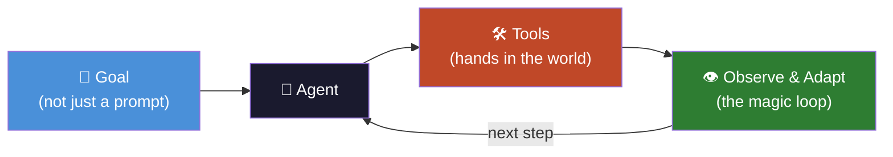
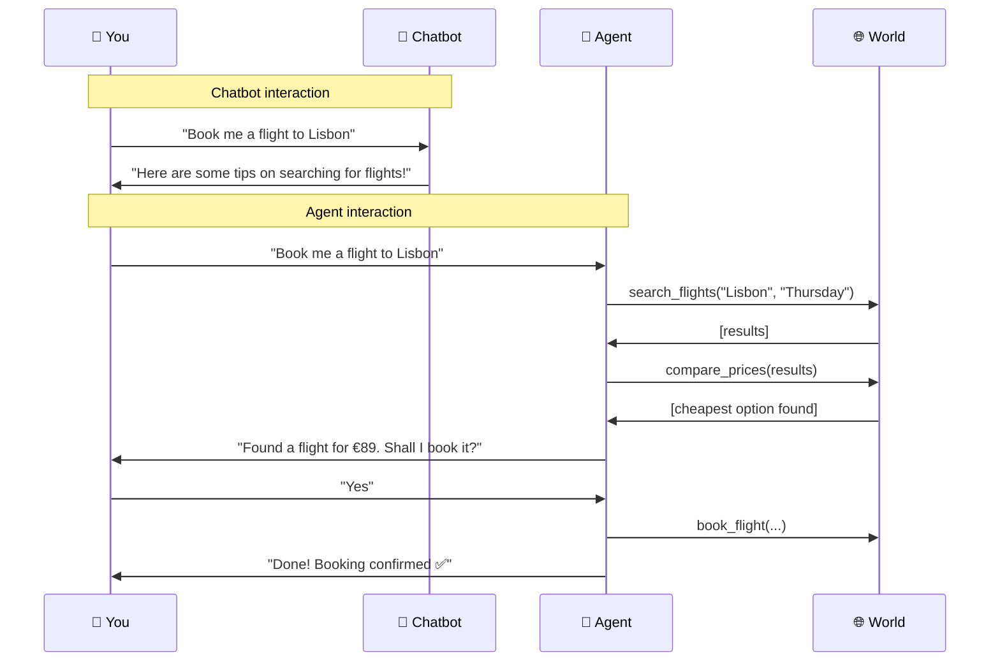
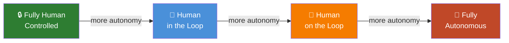

# 🤖 What Is an AI Agent?

*Chapter 01 of [Foundations](README.md)*

---

> *"The Answer to the Great Question of Life, the Universe and Everything is forty-two.
> The answer to what an AI agent is has been less forthcoming, despite significantly
> more conference talks on the subject."*

---

## 😐 The Unhelpful Answer Everyone Gives First

An AI agent, according to the internet, is:

> *"An autonomous AI system that perceives its environment, makes decisions,
> and takes actions to achieve goals."*

This definition is accurate in the same way that "a car is a metal box that moves"
is accurate. Technically correct. Utterly useless for actually building one. Probably 
fine for a Wikipedia lead paragraph. Not useful for understanding why your agent just
 sent 47 emails when you asked it to "follow up with leads."

Let's try again.

---

## 💡 The Actually Useful Answer

Imagine you hire an assistant. Not a clever assistant — one who can only follow written
instructions — but one who reads very fast, never gets tired, and has somehow memorised
most of the internet.

You leave them a note:

> *"Book me a flight to Lisbon next Thursday, cheapest option, window seat, no connections."*

And you walk away.

**A chatbot** 🤖 - your old assistant - would say: *"Here are some tips on how to search for flights!"* or, 
if it was having a good day, "I found this URL for you." Then it would have sat there, blinking, waiting for you to do the rest.

**An agent** ✈️ **books the flight.**

It searches the web. It compares prices. It checks your calendar. It reads the airline's
terms and conditions (all of them, without complaining, which is frankly suspicious). 
It fills in the form. It pauses and asks you to confirm before paying — because it 
has been trained to know that spending your money without permission is, legally and socially, A Thing.

Then it books the flight.

*That* is an AI agent.

> *FIELD GUIDE ENTRY - AI Agent: A system that takes a goal, breaks it into steps, uses tools to execute those steps, observes what happened, and keeps going until it's done or something explodes. Metaphorically. Usually.*

---

## 🏗️ The Three Things That Make an Agent an Agent

Strip away the jargon, the whitepapers, the conference talks, and the LinkedIn posts, and you'll find that every AI agent is built around three ideas.

### 🎯 1. It Has a Goal, Not Just a Prompt

A chatbot responds. An agent *pursues*.

You give an agent an objective — *"find me three competitors to this product"* or
*"monitor this website and alert me when the price drops"* — and the agent figures
out how to get there. The goal persists across multiple steps. The agent doesn't
forget what it was doing just because it had to search the web in the middle.

### 🛠️ 2. It Can Use Tools

This is the big one. This is what makes agents genuinely different from very eloquent
text boxes.

Tools are the agent's hands. Without tools, an agent is just a language model: brilliant
at reasoning, completely incapable of affecting the world. With tools, it can search the
web, run code, read files, send emails, query databases, call APIs — and, if given a
particularly unfortunate set of permissions, accidentally restructure your company's
entire folder system.

The tools are just functions. The agent decides when to call them.

### 👁️ 3. It Can Observe and Adapt

An agent doesn't fire off a predetermined sequence of actions. It looks at what
happened — the tool output, the error message, the unexpected result — and *adjusts*.

The flight search returned no results? The agent tries different dates. The API call
failed? The agent reads the error and tries a different endpoint. The code has a bug?
The agent reads the traceback and fixes it.

This loop — **act → observe → think → act again** — is what separates an agent from
a very sophisticated script.

Scripts fail silently or loudly. Agents *try* to recover.

---

## ⚔️ Chatbot vs Agent

| | 🤖 Chatbot | 🦾 Agent |
|---|---|---|
| **Input** | A message | A goal |
| **Output** | A reply | A result |
| **Tools** | Usually none | Yes — this is the point |
| **Memory** | Single conversation | Can persist across sessions |
| **Loop** | One turn | Multiple steps until done |
| **Fails by** | Saying something wrong | Doing something wrong |

That last row in the table is important. The failure modes are different in kind, not
just degree. An agent that hallucinates doesn't just give you a wrong answer — it can
**act** on that wrong answer. This is why agent safety and guardrails matter in a way
that chatbot safety doesn't quite capture.

---

## ⚠️ A Note on "Autonomous"

The word "autonomous" gets used a lot in this field. It covers everything from "runs
for 5 steps without human input" to "deploys its own sub-agents and spins up cloud
infrastructure."

When someone says their agent is autonomous, it is reasonable to ask:

- ⏱️ Autonomous for how long?
- 🎯 In what domain?
- 🛑 With what ability to stop itself when confused?

These are not gotcha questions. They are engineering questions.

---

## ✅ Summary

- An agent pursues a 🎯 **goal** across multiple steps
- It uses 🛠️ **tools** to interact with the world
- It 👁️ **observes results** and adapts its approach
- The failure modes are different from chatbots — and matter more

**Next:** [The Anatomy of an Agent →](02-anatomy-of-an-agent.md)

---

*← [Back to Foundations](README.md) · [Back to main guide](../README.md)*
