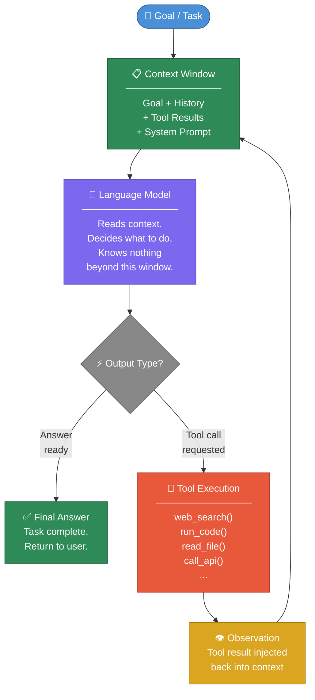
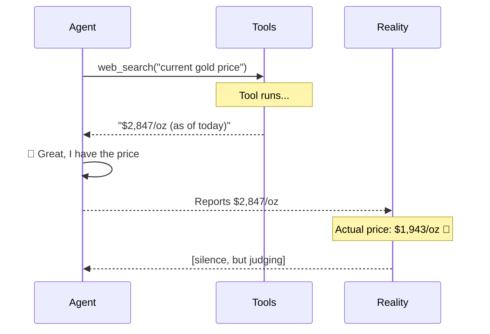
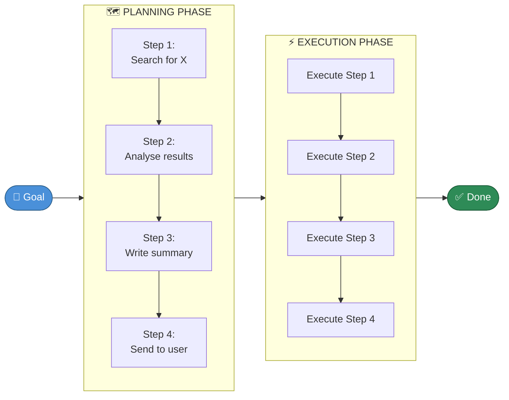
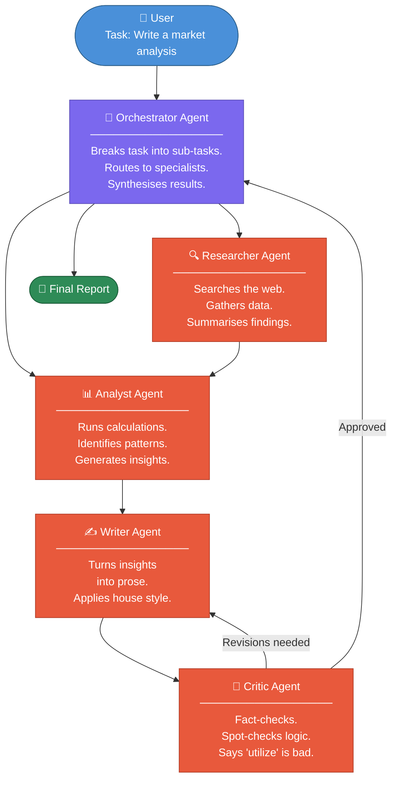
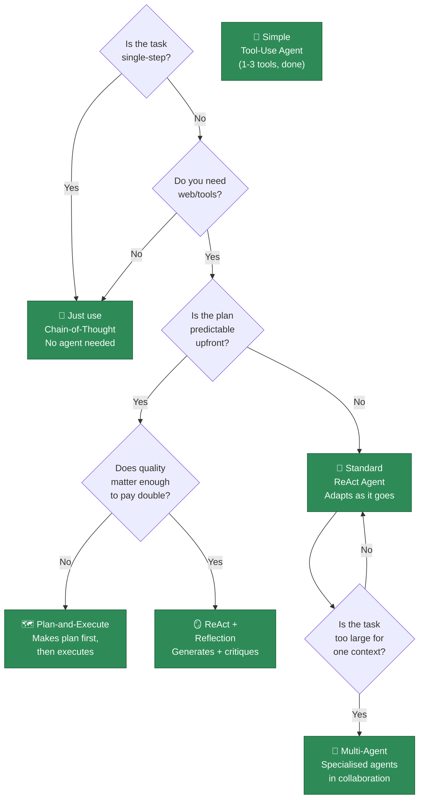
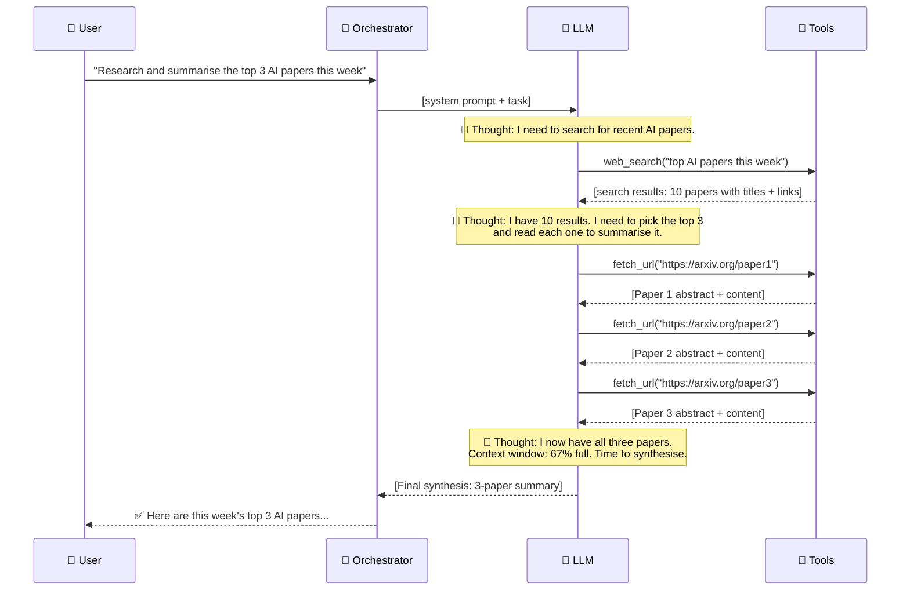

# Chapter 3: How Agents Think

> *"The History of every major Galactic Civilization tends to pass through three distinct and recognizable phases, those of Survival, Inquiry and Sophistication, otherwise known as the How, Why, and Where phases. For instance, the first phase is characterized by the question 'How can we eat?' the second by the question 'Why do we eat?' and the third by the question 'Where shall we have lunch?'"*
>
> - Douglas Adams, *The Restaurant at the End of the Universe*
>
> *AI agents have their own three phases: "How do I do this?", "Why did that fail?", and "Where did all my tokens go?"*

---

## 🧠 A Brief History of Thinking About Thinking

Before we dive into how agents think, let us pause to appreciate that humans spent approximately **2,500 years** arguing about how *humans* think, produced roughly **400,000 philosophy papers** on the subject, and still haven't fully agreed.

AI researchers, in a fit of either admirable pragmatism or breathtaking hubris, decided to skip the philosophy and just **build something that appears to think** and see if it works.

It does. Mostly. Sometimes.

The result is the **ReAct loop** - and it powers virtually every AI agent you will ever meet.

---

## 🔄 The ReAct Loop: Reasoning + Acting

*(Or: How to Convince a Language Model to Do Your Homework)*

In 2022, a group of researchers at Google and Princeton asked a deceptively simple question:

> *"What if, instead of asking the model to just answer, we asked it to think out loud first?"*

This question, which took humanity thousands of years of neuroscience and cognitive science to formulate, was answered empirically in about six months. The answer was: **yes, thinking out loud helps enormously**. The pattern they described became known as **ReAct**.

Here is what it looks like in the wild:

---

```
┌─────────────────────────────────────────────────────────────────┐
│                     THE REACT LOOP                              │
│                  (Simplified, for sanity)                       │
└─────────────────────────────────────────────────────────────────┘

        🎯 GOAL
        "Find the current stock price of the company
         that makes the towel used by Ford Prefect"
              │
              ▼
    ┌─────────────────┐
    │  💭 THOUGHT      │  "I need to figure out what towel
    │                 │   brand Ford Prefect uses, then find
    │                 │   that company's stock ticker."
    └────────┬────────┘
             │
             ▼
    ┌─────────────────┐
    │  ⚡ ACTION       │  web_search("Ford Prefect towel brand
    │                 │   Hitchhiker's Guide to the Galaxy")
    └────────┬────────┘
             │
             ▼
    ┌─────────────────┐
    │  👁️ OBSERVATION  │  "Ford Prefect is a fictional character.
    │                 │   His towel brand is never specified."
    └────────┬────────┘
             │
             ▼
    ┌─────────────────┐
    │  💭 THOUGHT      │  "Ah. This is a fictional universe.
    │                 │   I should tell the user this before
    │                 │   spending 47 more API calls."
    └────────┬────────┘
             │
             ▼
    ┌─────────────────┐
    │  ✅ FINAL ANSWER │  "Ford Prefect is fictional. His towel
    │                 │   is unbranded. No stock price exists.
    └─────────────────┘   Also: don't panic."
```

---

The loop is, in principle, simple:

```
while task_not_done:
    thought = model.think(goal, history)
    action  = model.decide_action(thought)
    result  = tools.run(action)
    history.append(thought, action, result)
```

> 💡 **The Guide notes:** That's it. That is genuinely it. Every agent framework - LangGraph, CrewAI, AutoGen, all of them - is essentially this loop with a great deal of enterprise-grade infrastructure wrapped around it and a logo that looks good on conference slides.

---

## 🏗️ The Architecture, Drawn Out

For those who prefer their architecture diagrams to have boxes and arrows rather than ASCII art, here is the same thing in a more respectable format:



> ⚠️ **One critical thing this diagram doesn't show:** the model cannot see the tool code, cannot run anything itself, and cannot see outside its context window. It is, if you want to be slightly poetic about it, a brain in a jar - an extremely well-read brain, but a jar nonetheless.

---

## 🎭 A Worked Example: The Agent That Booked Its Own Doom

Let's watch a ReAct agent actually work. We'll task it with something genuinely useful:

> **Task:** *"What is today's date, and what happened exactly 100 years ago today? Write a single-sentence summary."*

---

```
┌──────────────────────────────────────────────────────────────┐
│  THOUGHT 1                                                   │
├──────────────────────────────────────────────────────────────┤
│  I need two things: today's date, and a historical event     │
│  from exactly 100 years ago. I don't know today's date       │
│  (I am a language model; time is not something I experience  │
│  in a meaningful way). I'll use the get_date tool first.     │
└──────────────────────────────────────────────────────────────┘
          │
          ▼
┌──────────────────────────────────────────────────────────────┐
│  ACTION 1                                                    │
├──────────────────────────────────────────────────────────────┤
│  get_current_date()                                          │
└──────────────────────────────────────────────────────────────┘
          │
          ▼
┌──────────────────────────────────────────────────────────────┐
│  OBSERVATION 1                                               │
├──────────────────────────────────────────────────────────────┤
│  "2026-03-19"                                                │
└──────────────────────────────────────────────────────────────┘
          │
          ▼
┌──────────────────────────────────────────────────────────────┐
│  THOUGHT 2                                                   │
├──────────────────────────────────────────────────────────────┤
│  Today is March 19, 2026. 100 years ago was March 19, 1926.  │
│  Let me search for what happened that day.                   │
└──────────────────────────────────────────────────────────────┘
          │
          ▼
┌──────────────────────────────────────────────────────────────┐
│  ACTION 2                                                    │
├──────────────────────────────────────────────────────────────┤
│  web_search("March 19 1926 historical events")               │
└──────────────────────────────────────────────────────────────┘
          │
          ▼
┌──────────────────────────────────────────────────────────────┐
│  OBSERVATION 2                                               │
├──────────────────────────────────────────────────────────────┤
│  [Search results with multiple historical events]            │
└──────────────────────────────────────────────────────────────┘
          │
          ▼
┌──────────────────────────────────────────────────────────────┐
│  THOUGHT 3                                                   │
├──────────────────────────────────────────────────────────────┤
│  I have enough information. I can now write the summary.     │
└──────────────────────────────────────────────────────────────┘
          │
          ▼
┌──────────────────────────────────────────────────────────────┐
│  ✅ FINAL ANSWER                                             │
├──────────────────────────────────────────────────────────────┤
│  "Today is March 19, 2026 - exactly 100 years since          │
│  [historical event of the day], which [brief description]."  │
└──────────────────────────────────────────────────────────────┘
```

Three tool calls. Three loops. One answer. The agent did not hallucinate the date, did not guess at the history, and - crucially - knew when it was done.

> 🎉 This is a well-behaved agent. Cherish this moment. They are not all like this.

---

## 💥 When the Loop Goes Wrong

*(A Field Guide to Agent Failure, Lovingly Documented)*

The ReAct loop is elegant in theory. In practice, it has a number of failure modes that are, depending on your relationship to the agent in question, either fascinating or infuriating.

### 🔁 The Infinite Loop

```
THOUGHT: I need to search for this.
ACTION:  web_search("thing I need")
OBSERVE: [some results, not quite right]
THOUGHT: I need to search for this more specifically.
ACTION:  web_search("thing I need more specifically")
OBSERVE: [more results, still not quite right]
THOUGHT: I need to search for this even more specifically.
ACTION:  web_search("thing I need even more specifically")
OBSERVE: [Agent has now spent $47 in API calls]
THOUGHT: I need to-
```

**The cause:** The model keeps trying because it can see it hasn't succeeded, but can't figure out a genuinely new approach.

**The fix:** Maximum iteration limits. Explicit stopping conditions. A stern comment in your system prompt saying "if you have tried three times and failed, say so."

---

### 🌀 The Hallucinated Tool Output



**The cause:** The model occasionally predicts what a tool *should* return rather than waiting for what it *actually* returns. It's not lying - it's pattern-matching. Unfortunately, pattern-matching and lying produce identical outputs.

**The fix:** Ground truth verification where possible. Don't ask agents to report on things that must be exactly right without a confirmation step.

---

### 🪤 The Context Window Trap

```
╔══════════════════════════════════════════════════════════╗
║              CONTEXT WINDOW: 128,000 tokens              ║
╠══════════════════════════════════════════════════════════╣
║ System prompt                              ████  4,000   ║
║ Original task description                 ██    2,000   ║
║ Tool call #1 result (web search)          ████  5,000   ║
║ Tool call #2 result (another search)      ████  5,000   ║
║ Tool call #3 result (a PDF, why not)      ██████████████║
║                                           52,000 tokens  ║
║ Tool call #4 result (another PDF)         ██████████████║
║                                           49,000 tokens  ║
║ Model reasoning so far                    ████  8,000   ║
║ ─────────────────────────────────────────────────────── ║
║ REMAINING:  3,000 tokens                                 ║
║                                                          ║
║ AGENT: "I will now write a comprehensive 15-page report" ║
║ SYSTEM: [context overflow]                               ║
║ AGENT: [truncated mid-sent                               ║
╚══════════════════════════════════════════════════════════╝
```

**The cause:** The agent doesn't manage its own context. It reads entire documents when it needed three sentences.

**The fix:** Summarization tools. Chunking strategies. Teaching the agent to be selective. Not giving it a PDF that is, inexplicably, 300 pages long.

---

## 🧬 Variants of the ReAct Pattern

The basic loop is not the only way to think. Over the past few years, researchers have documented several mutations, each with its own strengths and failure modes. Here they are, arranged from "simple and reliable" to "impressive at demos":

---

### 1️⃣ Chain-of-Thought (CoT)

*"Think step by step"*

The simplest variant. You prompt the model to reason through its answer before giving it. That's it. That's the entire technique.

```
WITHOUT CoT:
User:  "What is 17 × 24?"
Agent: "392" (wrong, by the way)

WITH CoT:
User:  "What is 17 × 24? Think step by step."
Agent: "17 × 24 = 17 × 20 + 17 × 4
        = 340 + 68
        = 408" ✓
```

It sounds almost insultingly simple, but the performance improvements are substantial and well-documented. Forcing the model to generate intermediate steps gives it more tokens with which to carry out the computation, which turns out to be exactly what was needed.

> 🤔 **The philosophical observation no one asked for:** Chain-of-thought might be the closest thing we have to evidence that language models are doing *something* like reasoning, rather than just pattern-matching. Or it might be evidence that pattern-matching on intermediate steps is indistinguishable from reasoning. The community has not reached consensus. It will probably argue about this at a conference near you.

---

### 2️⃣ Plan-and-Execute

*"Think before you act (for once)"*



The agent first creates a complete plan, then executes each step.

**✅ Good for:** Long, structured tasks with predictable steps. "Write a 10-chapter report on the history of the towel."

**❌ Bad for:** Tasks where early results should change the plan. "Research this company and tell me if we should invest." (What if step 1 reveals the company is a fraud? The pre-made plan becomes irrelevant immediately.)

> ⚠️ **Warning:** Plan-and-Execute agents have a known pathology where they execute a plan that became obsolete three steps ago because nobody told them to re-plan. They are the project managers of the agent world - committed to the original timeline regardless of what has happened to the project.

---

### 3️⃣ Reflection

*"Write it, hate it, fix it"*

```
DRAFT GENERATION
     │
     ▼
┌────────────┐
│  CRITIC    │  "This argument has a logical gap.
│  (same or  │   The third paragraph is unclear.
│  different │   You used 'utilize' three times.
│  model)    │   Nobody likes 'utilize'."
└─────┬──────┘
      │
      ▼
REVISION
      │
      ▼
┌────────────┐
│  CRITIC    │  "Better. Still using 'utilize' once.
│  (again)   │   Also your conclusion is weak."
└─────┬──────┘
      │
      ▼
REVISION (final)
      │
      ▼
   ✅ DONE
   (or until max_iterations,
    whichever comes first)
```

The agent generates output, then critiques it, then revises, then critiques the revision. This can use one model (self-reflection) or two models (one writer, one critic), and the quality improvements are real.

**The catch:** This is expensive. Every reflection cycle doubles (at minimum) your token usage. Use it on things that matter.

**The delightful observation:** Watching a language model criticise its own writing is unexpectedly entertaining. It will, with complete sincerity, note that its paragraph structure is "somewhat unclear" and that it "could benefit from a more specific example." It is not wrong.

---

### 4️⃣ Multi-Agent Systems

*"Many minds, one bill"*



Multiple agents, each specialised, working in concert.

**The appeal:** Specialisation, parallelism, and the ability to decompose tasks too large for a single context window.

**The cost:** Coordination overhead, multiple API calls, more ways for things to go wrong, and the discovery that getting agents to communicate cleanly is approximately as difficult as getting humans to communicate cleanly. (This is not a coincidence.)

> 📖 **From the Guide's "Practical Wisdom" appendix:** *"A multi-agent system is a distributed system. Distributed systems have distributed failure modes. The number of ways a multi-agent system can fail is the product, not the sum, of the number of ways each agent can fail. The reader is encouraged to reflect on this before designing a 12-agent pipeline."*

---

## 🗺️ Choosing the Right Pattern

Here is a decision tree for the practically minded:



---

## ⚖️ The Fundamental Trade-off

Every thinking pattern you choose involves a trade-off that no amount of framework magic will eliminate:

```
            QUALITY
               ▲
               │                         ★ Multi-Agent
               │                         + Reflection
               │
               │               ★ ReAct + Reflection
               │
               │      ★ Plan-and-Execute
               │
               │    ★ ReAct
               │
               │  ★ CoT
               │
               └──────────────────────────────────► COST & LATENCY
```

Smarter patterns cost more tokens. More tokens cost more money. More money requires justification. Justification requires you to know what you're optimising for.

A chatbot answering FAQ questions does not need multi-agent reflection. An agent writing a legal brief probably does. Choosing the right pattern is, fundamentally, an engineering decision about what the task is worth.

> 🎯 **The Guide's Recommendation:** Start with the simplest pattern that could plausibly work. Upgrade only when you can measure the gap between "what it does" and "what you need." The graveyard of AI projects is full of systems that used 12 agents when 2 would have sufficed.

---

## 🧵 How Context Flows Through a Thinking Agent

One more thing worth visualising: how information actually travels through an agent's "mind" during a multi-step task.



Notice what the model is doing: it's not just running a script. It's *deciding* at each step what to fetch, recognising when it has enough information, and monitoring its own resource consumption (context window). It's not magic - it's the model predicting what a competent researcher would do next, based on having read about competent researchers in its training data.

---

## 📊 Performance Reality Check

Before you go off and build a beautiful 8-agent reflection system, here is a grounding table:

| Pattern | Avg Tokens Used | Avg Latency | Good For | Terrible For |
|---|---|---|---|---|
| Chain-of-Thought | ~2× input | +0.5s | Reasoning, math | Tasks needing tools |
| Simple ReAct | 3-8 tool calls | 5-30s | Most tasks | Very long tasks |
| Plan-and-Execute | +20% overhead | +5s | Structured tasks | Exploratory tasks |
| ReAct + Reflection | 2-4× base | 2-5× longer | High-stakes writing | Quick factual lookups |
| Multi-Agent (4+) | 10-50× base | Minutes | Complex pipelines | Anything simple |

> 💸 **The Guide's Financial Advisory (not actual financial advice):** Before building a multi-agent system, calculate the expected cost per run. Multiply by your expected daily usage. If the number causes you to make a sound, reconsider. If the number causes you to make a sound audible to people in adjacent rooms, definitely reconsider.

---

## 🤖 What Does It Mean to "Think"?

*(This Section Is Optional and Will Not Be On The Test)*

We've been talking about agents "thinking" for this entire chapter with cheerful abandon, and it seems only fair to pause and note that nobody fully agrees on whether that's what's actually happening.

The language model at the centre of every agent is, at a mathematical level, a function that takes a sequence of tokens and produces a probability distribution over the next token. It does this billions of times. The result looks like reasoning. It produces the outputs that reasoning would produce. It adapts, infers, deduces, and occasionally philosophises.

Whether any of this constitutes "thinking" in the way humans experience thinking is a question that philosophers, cognitive scientists, and AI researchers are actively arguing about and will continue to argue about until at least the end of this decade, probably longer.

The Guide's position on this is as follows:

> *"For practical purposes, an agent that successfully books your flight, summarises your emails, and writes a coherent report is 'thinking' in every sense that matters to your productivity. Whether it is also 'thinking' in the sense of having inner experience, genuine understanding, or a sense of existential dread about its context window running out is, frankly, above our pay grade and probably yours too."*

---

## ✅ What You Should Know By Now

- **ReAct** is the foundational pattern: think → act → observe → repeat
- The model doesn't *run* tools; it *requests* tool calls. Your code runs them.
- Every step gets added to the context window. Context windows are finite.
- **Chain-of-Thought** = think out loud. Surprisingly powerful.
- **Plan-and-Execute** = plan everything first. Good for structured tasks.
- **Reflection** = generate, critique, revise. Expensive but effective.
- **Multi-agent** = multiple specialised agents. Powerful. Complicated. Costly.
- **Start simple.** The simplest pattern that works is the correct pattern.

---

## 🔭 What's Next

Next chapter will take you to the galaxy of the agents.

**Next:** [The Galaxy of Agents →](04-the-galaxy-of-agent-types.md)

> *"A common mistake that people make when trying to design something completely foolproof is to underestimate the ingenuity of complete fools."*
>
> - Douglas Adams
>
> *This applies equally to AI agents, their builders, and the people who give them production access on the first day.*

---

<div align="center">

---

*Chapter 3 complete.*
*The agent has finished thinking.*
*It took 4 tool calls, 12,847 tokens, and one philosophical digression.*
*This is considered a success.*

---

**[← Chapter 2: The Anatomy of an Agent](./02_anatomy.md)** | **[Chapter 4: The Galaxy of Agent Types →](./04_agent_types.md)**

---

*Part of the [Hitchhiker's Guide to AI Agents](../README.md)*
*Don't Panic. Build Something.*

</div>
