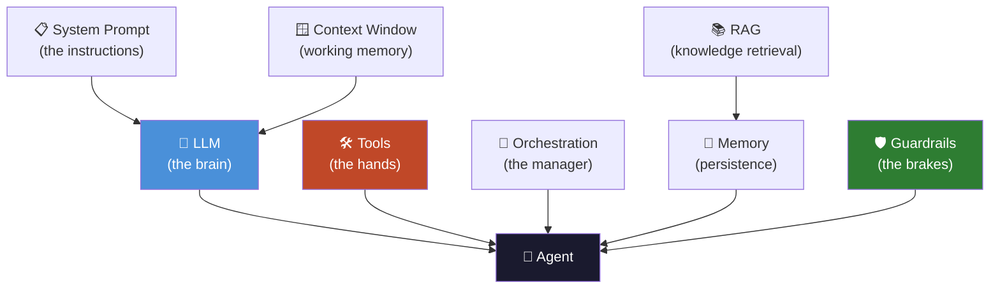
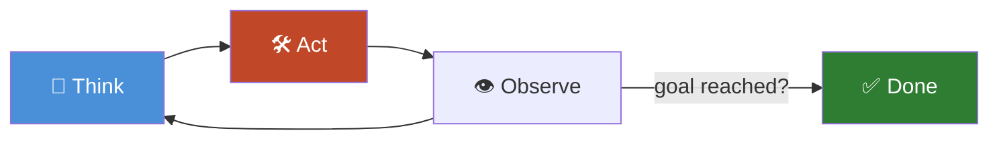
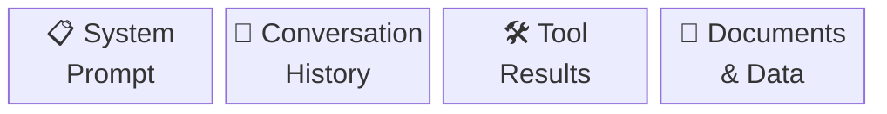
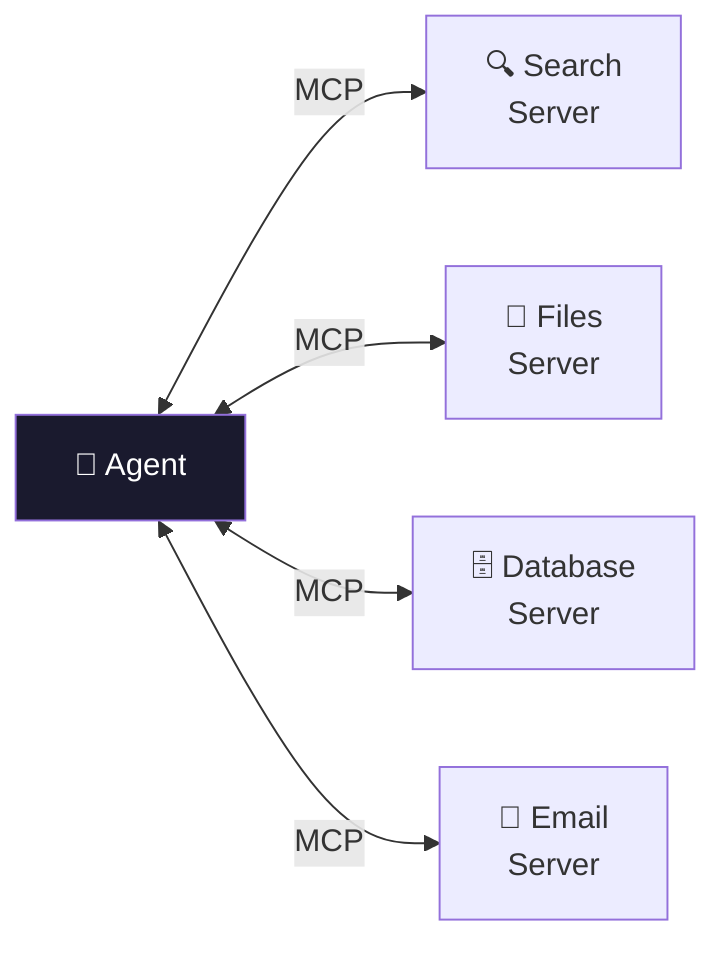
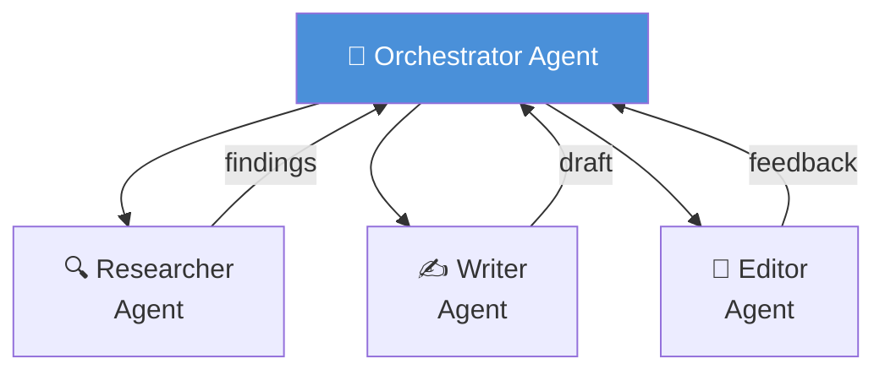
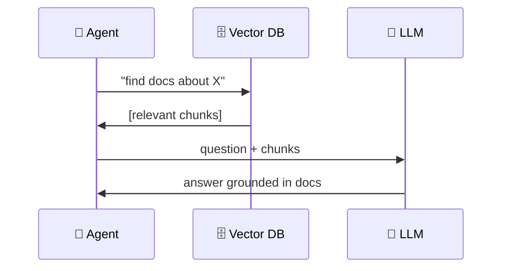
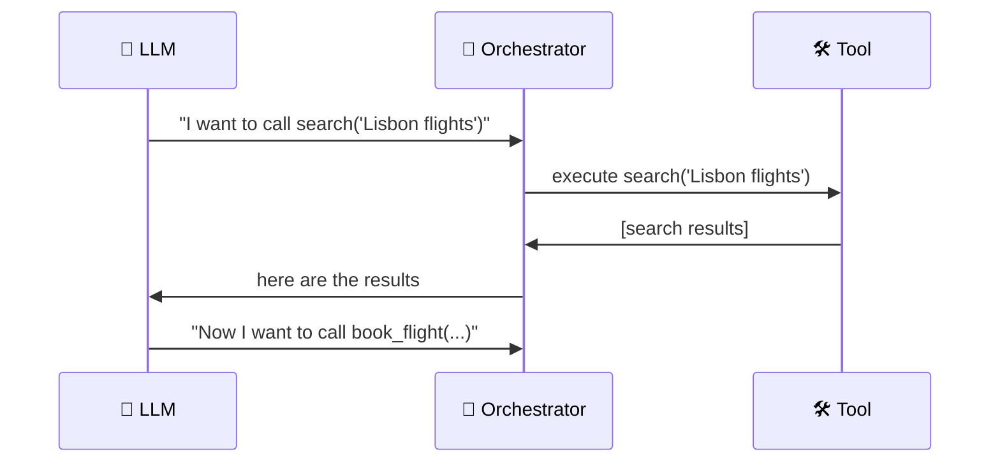

# 📖 Glossary

*Chapter 05 of [Foundations](README.md)*

---

> *"The Guide is definitive. Reality is frequently inaccurate."*

The field of AI agents has a jargon problem. Terms are used confidently, inconsistently,
and sometimes in direct contradiction with how the same term was used in the paper
published last Tuesday.

The following are the most honest definitions available as of the time of writing.

---

## 🗺️ How the Terms Connect

---

## 🔤 A

---

### 🤖 Agent

An AI system that pursues goals, uses tools, and adapts based on observations.
See [Chapter 01](01-what-is-an-agent.md) for the full treatment. Sometimes also
used to mean "any AI that does more than one thing in sequence," which is less
useful but extremely common.

---

### 🔄 Agentic Loop

The cycle of think → act → observe that powers most agents. Also called the
"agent loop," the "reasoning loop," or, by engineers debugging a stuck agent
at 2am, various other things.

---

### 🎚️ Autonomy

The degree to which an agent operates without human input. A spectrum, not a
binary. See the note at the end of [Chapter 01](01-what-is-an-agent.md).

---

## 🔤 C

---

### 🧵 Chain-of-Thought (CoT)

Prompting a model to reason step-by-step before answering. Dramatically improves
performance on reasoning tasks. Famous for working so well that it seemed like
cheating.

**Example:**

> ❌ Without CoT: *"What is 17 × 24? Answer: 388"* (wrong)
>
> ✅ With CoT: *"17 × 24. Let me think: 17 × 20 = 340, 17 × 4 = 68, 340 + 68 = 408"* (correct)

---

### 🪟 Context Window

The maximum amount of text (in tokens) a model can process at once. Everything
the agent knows about its current task must fit here. When it doesn't fit, you
have an architecture problem.

> ⚠️ **The context window is finite.** When it fills up, the agent starts forgetting
> things. Exactly which things it forgets is, philosophically speaking, unsettling.

---

## 🔤 F

---

### 📞 Function Calling

See *Tool use*. Same thing, different name used by different providers.

---

### 🛡️ Guardrails

Constraints on what an agent can do. Implemented in the system prompt, in tools
themselves, in the orchestration layer, or all three if you are wise.

| Layer | Example |
|-------|---------|
| 🗒️ System prompt | "Never send an email without user confirmation" |
| 🛠️ Tool level | Rate limits, confirmation steps built into the tool |
| 🎼 Orchestration | Output classifiers, hard stop conditions |
| 👤 Human in loop | Pause and ask before irreversible actions |

---

## 🔤 H

---

### 👻 Hallucination

When a model generates confident, fluent, plausible-sounding nonsense. In a
chatbot, annoying. In an agent that acts on its outputs, a production incident.
Understanding when hallucinations occur is foundational to building trustworthy
agents.

> 🚨 **Why it matters more for agents:** A chatbot that hallucinates gives you a
> wrong answer. An agent that hallucinates might book the wrong flight, send the
> wrong email, or delete the wrong files.

---

## 🔤 M

---

### 🔌 MCP (Model Context Protocol)

A standard for connecting language models to tools and data sources. Developed
by Anthropic, now widely adopted. Essentially a USB standard for agent tools —
implement once, works everywhere. Covered in detail in
[Section 03](../03_frameworks/README.md).

---

### 💾 Memory

How agents persist information. Four types:

| 🏷️ Type | 📍 Where it lives | ✅ Best for |
|---------|------------------|------------|
| 🪟 In-context | The context window | Short tasks, recent history |
| 🗄️ External | A database | Facts, structured data |
| 🔮 Semantic | Vector embeddings | Fuzzy similarity search |
| 📼 Episodic | Logs of past runs | Long-running agents |

See [Chapter 02](02-anatomy-of-an-agent.md) for the full breakdown.

---

### 👥 Multi-Agent System

Multiple agents collaborating on a task, each specialised, coordinated by an
orchestrator. Powerful. Also a great way to multiply your infrastructure costs
and discover new distributed systems problems.

---

## 🔤 O

---

### 🎼 Orchestration

The code that manages the agent loop: passes tool results back, handles errors,
decides when to stop, routes between agents. Can be a while loop. Can be a
graph-based state machine with conditional routing. [Section 03](../03_frameworks/README.md)
covers the frameworks that do this for you.

---

## 🔤 R

---

### 📚 RAG (Retrieval-Augmented Generation)

Giving agents access to knowledge that doesn't fit in the context window by
storing it in a database and retrieving relevant chunks on demand. Not the same
as an agent, but most agents that need domain knowledge use some form of RAG.

---

### ⚛️ ReAct

Reasoning + Acting. The standard agent pattern:

1. 🧠 Think about what to do
2. 🛠️ Call a tool
3. 👁️ Observe the result
4. 🔄 Think again
5. ✅ Repeat until done

See [Chapter 03](03-how-agents-think.md) for the full breakdown with code.

---

## 🔤 S

---

### 📋 System Prompt

Instructions given to the model before the user's input. Where you define the
agent's role, tools, constraints, and context. The quality of your system prompt
is directly correlated with the quality of your agent's outputs. This is not
a metaphor.

> 💡 **Rule of thumb:** If your agent is behaving strangely, the system prompt
> is the first place to look. Not the model. Not the framework. The system prompt.

---

## 🔤 T

---

### 🪙 Token

The unit of text a language model processes. Roughly ¾ of a word in English.
Models are billed by token. Context windows are measured in tokens. Your
infrastructure costs are measured in tokens.

| Text | Approx tokens |
|------|--------------|
| "Hello" | 1 |
| This sentence | ~6 |
| One page of text | ~500 |
| This entire glossary | ~2,000 |
| War and Peace | ~580,000 |

---

### 🛠️ Tool

A function the agent can call to interact with the world: search the web, run
code, read files, call APIs. The model doesn't run the tool — it requests the
call, your code runs it, the result goes back to the model.

---

### 🤝 Tool Use / Function Calling

The capability that allows a model to request execution of external functions.
The thing that turns a language model into an agent.

---

*← [Back to Foundations](README.md) · [Back to main guide](../README.md)*
