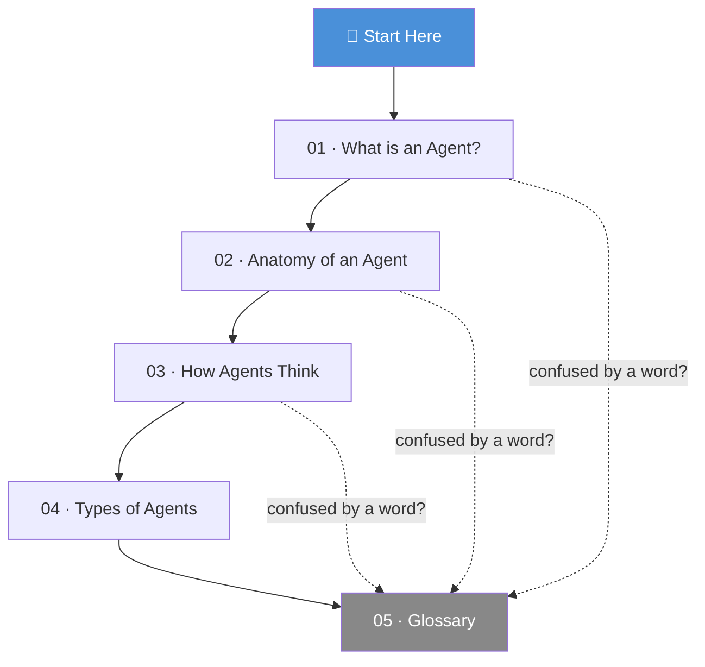

# 🌌 01 · Foundations

> *"In the beginning, the Universe was created. This made a lot of people very angry
> and has been widely regarded as a bad move. AI agents were created much later,
> and had roughly the same effect on the software industry."*

Welcome to the Foundations section — the part where we establish ground truth
before anyone starts arguing about frameworks.

By the end of this section you will know:

- 🧠 What an AI agent actually is (and isn't)
- 🔬 What's physically inside one
- ⚙️ How it reasons and acts
- 🗺️ What kinds of agents exist
- 📖 What every term means when people throw jargon at you

No prior agent experience required. A tolerance for analogies is helpful.

---

## 🗺️ The Section at a Glance

---

## 📄 Chapters

| # | File | What it covers |
|---|------|----------------|
| 01 | [What is an AI Agent? 🤖](01-what-is-an-agent.md) | The real definition, the three core properties, why it's different from a chatbot |
| 02 | [Anatomy of an Agent 🔬](02-anatomy-of-an-agent.md) | Brain, tools, memory, context window, orchestration — dissected |
| 03 | [How Agents Think ⚙️](03-how-agents-think.md) | The ReAct loop, CoT, Plan-and-Execute, Reflection — with code |
| 04 | [Types of Agents 🗺️](04-types-of-agents.md) | A taxonomy, from simple tool-callers to multi-agent systems |
| 05 | [Glossary 📖](05-glossary.md) | Every term you'll hear, honest definitions, no circular explanations |

---

## 🚀 Recommended Reading Order

Read them in order **(01 → 05)** if you're starting from scratch.

Jump to [03 · How Agents Think](03-how-agents-think.md) if you know the basics
and want the mechanics.

Jump to [05 · Glossary](05-glossary.md) if someone just used a word you don't know.

---

*← [Back to main guide](../README.md)*
