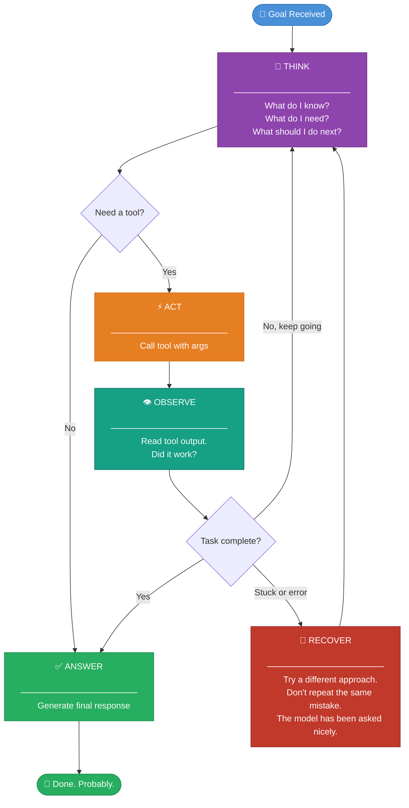

## 🔄 Pattern 01 · The ReAct Loop

> *"It is a mistake to think you can solve any major problems just with potatoes."*
> — Douglas Adams
>
> *It is also a mistake to think you can solve any agent problem without a loop.*
> *The loop is the potatoes of agent design. You need it. You always need it.*

### What It Is

**ReAct** stands for **Re**asoning + **Act**ing. It was introduced in a 2022 paper, immediately became the foundational pattern for almost every agent system in production, and has been independently rediscovered by approximately every engineer who has tried to build anything agentic from scratch.

The core idea is, genuinely, this simple:

```
Think → Act → Observe → Think → Act → Observe → ... → Done
```

That's it. The power is not in the loop itself — the loop is just a `while`. The power is in what the model does *inside* the Thought step: the reasoning, the evaluation, the decision to try something different when the last thing didn't work. And the fact that this reasoning happens in plain text, which means the model can build on it with every iteration.

It is simple the way calculus is simple once you understand what a derivative is.

---

### 🗺️ The Full ReAct Flow



---

### 🔬 Anatomy of a Single ReAct Step

Here is what the model actually produces during a ReAct loop — raw output, before any framework makes it pretty:

```
┌────────────────────────────────────────────────────────────────────┐
│  STEP 1                                                            │
│                                                                    │
│  Thought: The user wants the current population of Tokyo.          │
│           I should search — population figures change over time.   │
│                                                                    │
│  Action: web_search                                                │
│  Action Input: {"query": "Tokyo population 2026"}                  │
│                                                                    │
│           ── [ Tool executes here. You don't see this part. ] ──   │
│                                                                    │
│  Observation: Tokyo's population as of 2024 is approximately       │
│               14 million in the city proper, and 36.9 million      │
│               in the greater metropolitan area.                    │
│                                                                    │
├────────────────────────────────────────────────────────────────────┤
│  STEP 2                                                            │
│                                                                    │
│  Thought: I have both figures. I can provide both and let the      │
│           user clarify which definition they meant.                │
│           I have enough to answer.                                 │
│                                                                    │
│  Action: respond  (no tool needed)                                 │
│                                                                    │
│  Final Answer: Tokyo has about 14 million people in the city       │
│                proper, or 36.9 million in the greater area...      │
└────────────────────────────────────────────────────────────────────┘
```

> **Notice something:** The model narrates its reasoning out loud, in plain text, *before every action*. This is not inefficiency. This is the entire mechanism. The "Thought" step is the model thinking on paper. The paper is the context window. The context window is passed back to the model on the next step. The model reads what it thought last time, and builds on it.
>
> It is, philosophically, a model reading its own diary. This is either elegant or unsettling, and quite possibly both.

---

### 📊 What ReAct Is Good At (Honest Edition)

| ✅ Great for | ❌ Not great for |
|:------------|:----------------|
| Research and information gathering | Tasks requiring 20+ steps (context fills up; the agent forgets why it started) |
| Code generation and debugging loops | Exact, reproducible pipelines where determinism matters |
| Tasks where the path isn't known in advance | High-stakes actions without a human-in-the-loop checkpoint |
| Single-agent tasks with clear, bounded goals | Tasks where hallucinated tool results would go undetected |

---

### 💻 The Minimal Implementation

```python
def run_react_agent(goal: str, tools: list, llm, max_steps: int = 10):
    """
    A ReAct agent in ~20 lines.
    Don't tell the framework authors how simple it is.
    They have mortgages.
    """
    messages = [{"role": "user", "content": goal}]

    for step in range(max_steps):
        # 🧠 THINK: ask the model what to do next
        response = llm.chat(messages=messages, tools=tools)

        # ✅ Done if no tool call was requested
        if not response.has_tool_call():
            return response.text

        # ⚡ ACT: extract and run the tool the model asked for
        tool_name, tool_args = response.get_tool_call()
        result = execute_tool(tool_name, tool_args)  # your function

        # 👁️ OBSERVE: feed the result back into context
        messages.append({"role": "assistant", "content": response.raw})
        messages.append({"role": "tool", "content": str(result)})

    return "Max steps reached. The agent has given up. It is not proud of this."
```

> 🧑‍🚀 **Field Note:** This works with any LLM that supports tool/function calling. The frameworks you'll meet in Section 03 add error handling, observability, retries, state management, and approximately 4,000 lines of configuration options on top of this skeleton. Whether those additions are worth it depends on what you're building.

---