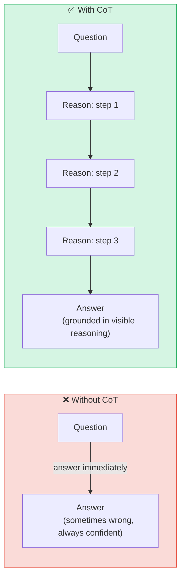

## 🔗 Pattern 02 · Chain-of-Thought

> *"Talking to yourself is the first sign of intelligence, not madness.*
> *Madness is when you stop listening to the answers."*

### What It Is

Chain-of-Thought (CoT) is not quite an agent pattern — it's a *thinking technique*. A way to make the model reason carefully before committing to an answer.

The discovery that shocked everyone: **you can make a language model substantially smarter just by asking it to think step by step before answering.**

This was demonstrated experimentally and triggered a round of *"that can't be right, let's run it again"* — followed by running it again, many times, with many models, getting the same result every time. A model told to reason step by step consistently outperforms the same model answering directly on tasks involving multi-step logic.

The explanation is not mystical. The intermediate reasoning tokens give the model more context to work with as it generates each subsequent token. The work is, literally, in the working.

---

### 🔗 The Three Flavours

```
┌──────────────────────────────────────────────────────────────────────┐
│                                                                      │
│   ZERO-SHOT CoT           FEW-SHOT CoT           AUTO CoT            │
│   ─────────────           ────────────           ────────            │
│                                                                      │
│   "Think step by    vs    Show examples     vs   Model generates     │
│    step."                 of good CoT            its own examples    │
│                           reasoning              before answering    │
│                                                                      │
│   Lazy but                Most reliable          Clever but          │
│   surprisingly            for known              overkill for        │
│   effective               problem types          most tasks          │
│                                                                      │
│   Start here.             Use when you           Use never,          │
│   Almost always           have good examples.    probably.           │
│   enough.                                                            │
│                                                                      │
└──────────────────────────────────────────────────────────────────────┘
```

---

### 🧮 CoT in Action: The Difference It Makes

**Without CoT** — the model pattern-matches to a plausible-sounding answer:

```
User:  A train leaves Station A at 9am going 60mph. Another leaves
       Station B (120 miles away) at 10am going 80mph. When do they meet?

Model: They meet at 10:45am.
                           ↑
                           Wrong. Confidently delivered. Completely wrong.
```

**With CoT** — the model actually solves the problem:

```
User:  [same question] Think through this step by step.

Model: Let me work through this carefully.

       Step 1: Train A leaves at 9am at 60mph.
               By 10am it has covered 60 miles.
               Remaining gap: 120 − 60 = 60 miles.

       Step 2: From 10am, both trains close the gap.
               Combined speed: 60 + 80 = 140 mph.

       Step 3: Time to close 60 miles at 140 mph:
               60 ÷ 140 ≈ 25.7 minutes.

       Step 4: They meet at approximately 10:26am.

       Answer: 10:26am.
                    ↑
                    Correct. The model didn't get smarter.
                    It got to show its work. The work is the smartness.
```

---

### 🗺️ Where CoT Fits in an Agent



---

### 📐 When to Use CoT (and When to Skip It)

**Apply CoT when the task involves:**

- 🔢 **Maths or counting** — anything where order of operations matters
- 🧩 **Multi-constraint problems** — *"find a flight that's cheap AND direct AND allows a carry-on"*
- 🔍 **Verification** — *"check whether this function does what the comment claims"*
- 🗺️ **Planning** — *"what's the best order to complete these seven things?"*
- ⚖️ **Tradeoff analysis** — *"compare these four options across six dimensions"*

**Skip CoT for:**
- Simple factual lookups (*"what is the capital of Portugal"*)
- Open-ended creative tasks (the intermediate steps don't constrain creativity, they just cost tokens)
- Anything where latency matters more than accuracy — CoT produces more tokens, costs more, takes longer

> 💬 **The guide notes:** The phrase "think step by step" has appeared in so many system prompts that it has become the machine learning equivalent of *"turn it off and on again."* Unlike that advice, it actually works more often than not.