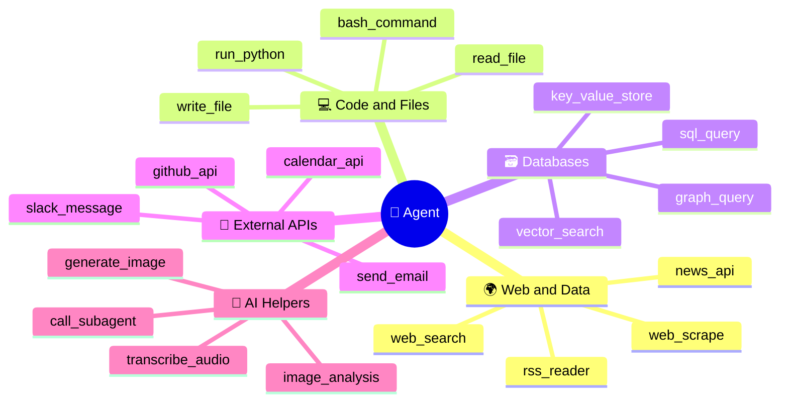
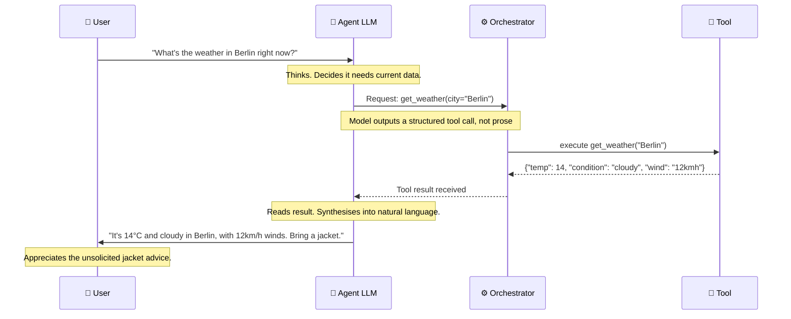

## 🛠️ Pattern 03 · Tool Use

> *"A spade is a spade. A language model with access to a spade is an agent with the capability to dig.*
> *This is either a tremendous power or an immediate liability, depending entirely on where you told it to dig."*

### What It Is

Tool use is the pattern that transforms a language model from a *text predictor* into an *actor*. Without tools, an agent can reason beautifully and accomplish precisely nothing outside its context window. With tools, it can reach out and touch the world — search the web, run code, read files, send messages, and a great many other things you may not have fully considered when you said *"let's just give it some tools."*

A tool is, at its most fundamental: **a function that the model can decide to call**.

The model does not run the function. It requests that the function be run. Your code runs it. This distinction matters, mostly because when the tool does something unexpected, both you and the model can blame the infrastructure.

---

### 🛠️ The Anatomy of a Tool

```
┌──────────────────────────────────────────────────────────────────┐
│  TOOL DEFINITION                                                 │
│  ─────────────────────────────────────────────────────────────   │
│                                                                  │
│  name:          "search_web"                                     │
│                                                                  │
│  description:   "Search the internet for current information.    │
│                  Use this when you need facts you don't know,    │
│                  or that may have changed since training."       │
│                  ↑                                               │
│                  The model reads this and decides when to call.  │
│                  Write it well. It matters more than you think.  │
│                                                                  │
│  parameters:                                                     │
│    query  (string, required): The search query                   │
│    n      (integer, default 5): Number of results                │
│                                                                  │
│  returns:  List of { title, url, snippet }                       │
│                                                                  │
└──────────────────────────────────────────────────────────────────┘
                           │
                           ▼
        The model reads this definition at runtime.
        The model decides when to call it.
        The model generates a structured call with arguments.
        YOUR CODE executes the actual function.
        The result returns to the model as an observation.
        The model decides what to do with the result.
        This is the entire mechanism. Nothing is hidden.
```

---

### 🌐 The Tool Ecosystem



---

### 🔄 The Tool Call Lifecycle



---

### ⚠️ The Tool Use Hall of Failure

*These are the mistakes everyone makes. Learning them here is free. Learning them from a production incident is expensive and involves a retrospective document.*

**🐛 The Hallucinated Tool Call**

```
What happens:
  The model decides to call send_email().
  Before the result comes back, it continues generating text
  as if the email had already been sent and confirmed.
  It wasn't. The model was predicting what success looks like.

Why it happens:
  Language models predict the next token. The most probable next
  tokens after "I'll send that email now" are tokens describing
  a successful send. The model doesn't wait to find out.

Fix:
  Always wait for actual tool results before proceeding.
  Never let the model narrate outcomes it hasn't received.
```

**♾️ The Infinite Loop**

```
What happens:
  Tool returns an error.
  Model calls the same tool with the same arguments.
  Tool returns the same error.
  Model calls the same tool with the same arguments.
  [continues until max_steps, generating only a large bill]

Fix:
  Track repeated identical calls. After 2–3 identical failures,
  inject a message prompting a different approach.
  Add max_iterations. Always add max_iterations.
```

**🔐 The Over-Permissioned Agent**

```
What happens:
  You give the agent access to delete_file() because it might
  need it someday. It uses it when it definitely shouldn't.
  You learn something about the principle of least privilege
  that you could have read in a textbook but now know in your bones.

Fix:
  Give agents the minimum set of tools they need for the task.
  Add confirmation steps for irreversible operations.
  Treat agent permissions the way you treat production DB access:
  carefully, reluctantly, with a lot of logging.
```

**📏 The Giant Tool Result**

```
What happens:
  The tool returns 50,000 words of data.
  This consumes 80% of the context window.
  The model loses track of the original goal.
  Is now summarising something tangential with great enthusiasm.

Fix:
  Truncate, paginate, or summarise tool results before injecting.
  Your tools should return the minimum information needed,
  not everything available.
```
