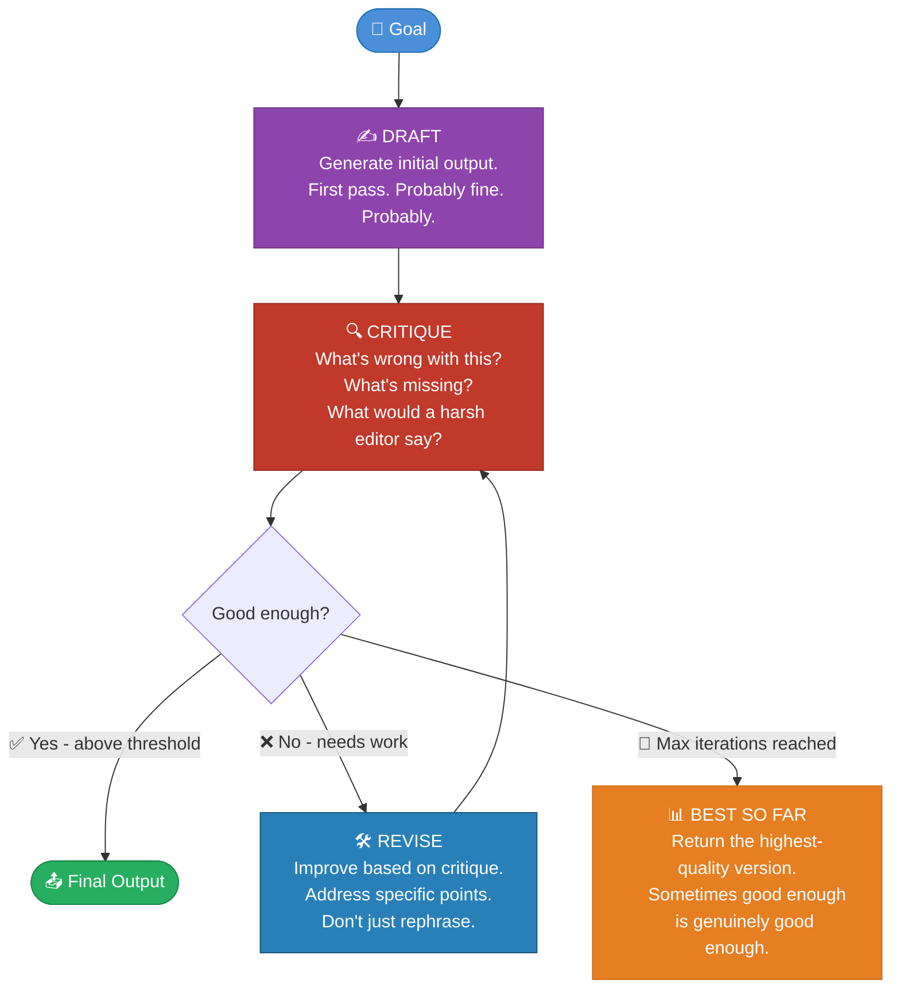

## 🪞 Pattern 04 · Reflection & Self-Critique

> *"The first draft of anything is garbage.*
> *This is true of novels, business plans, code, and agent outputs.*
> *The difference is that agents can be made to edit their own garbage,*
> *which is more than most novelists manage on the first attempt."*

### What It Is

Reflection is the pattern where an agent reviews its own output, identifies problems, and improves it - without human intervention, and without the existential discomfort of asking someone else to critique your work.

It sounds like it shouldn't work. The same model that produced the flawed output is reviewing it. Why would it do better?

It works because **generating** and **evaluating** are different cognitive operations. When you ask a model to produce output, it is completing a task. When you show it that completed output and ask it to critique it, it is reviewing something that already exists - and patterns that weren't salient during generation become salient during review. The model notices things it missed. Not always. But reliably enough to matter.

---

### 🔁 The Reflection Loop



---

### 🧠 One Model vs. Two Models

```
┌──────────────────────────────────────────────────────────────────┐
│                                                                  │
│   SINGLE-MODEL REFLECTION      TWO-MODEL REFLECTION              │
│   ────────────────────────     ─────────────────────             │
│                                                                  │
│   System prompt:               Model A (Generator):              │
│   "Write a summary.            Writes the summary.               │
│    Then, as a critical                                           │
│    editor, review and          Model B (Critic):                 │
│    improve it."                Reviews Model A's output.         │
│                                Produces a specific critique.     │
│                                Sends critique to Model A.        │
│   Cheaper. Faster.                                               │
│   Model sometimes goes         Model A (Generator):              │
│   easy on itself - rates       Revises based on critique.        │
│   its own work more            Repeats until good enough.        │
│   generously than an           ↑                                 │
│   outside judge would.         More expensive. More reliable.    │
│                                The critic has no ego investment. │
│                                                                  │
└──────────────────────────────────────────────────────────────────┘
```

---

### 💻 Reflection in Code

```python
def reflect_and_improve(goal: str, llm, max_rounds: int = 3) -> str:
    """
    A writer and a critic, locked in a room together.
    One of them always wins. It is usually the critic.
    This is also true of humans.
    """

    # Round 1: Generate initial draft
    draft = llm.generate(f"Complete this task: {goal}")

    for round in range(max_rounds):

        # The critic reviews
        critique = llm.generate(f"""
            Review this output critically.

            Task: {goal}

            Output to review:
            ---
            {draft}
            ---

            Identify specifically:
            1. Factual errors or unsupported claims
            2. Missing information the reader needs
            3. Unclear or confusing sections
            4. Anything that could be meaningfully improved

            Be specific. Be honest. This is a draft, not a masterpiece.
            If it is already good, say so. Don't critique for its own sake.
        """)

        # Check if improvement is actually warranted
        verdict = llm.generate(f"""
            Given this critique: {critique}

            Is the current output acceptable?
            Answer YES or NO, then one sentence explaining why.
        """)

        if verdict.strip().upper().startswith("YES"):
            break  # Good enough. Ship it.

        # Writer revises based on critique
        draft = llm.generate(f"""
            Task: {goal}

            Current draft:
            {draft}

            Critique received:
            {critique}

            Produce an improved version that specifically addresses
            the issues raised. Don't just rephrase - fix them.
        """)

    return draft
```

---

### 📈 When Reflection Is Worth the Cost

| Use it for | Skip it for |
|:-----------|:------------|
| 📝 Long-form writing where quality matters over speed | Simple factual lookups |
| 💻 Code generation - the critic spots bugs the generator missed | Time-sensitive tasks where latency matters more than quality |
| 🔬 Research synthesis - catching logical gaps and unsupported claims | Cases where the first pass is already high quality |
| 📋 Structured outputs - catching format violations, schema errors | Tasks where "good enough" is genuinely good enough |

> 💡 **Practical heuristic:** Before adding a reflection loop, ask: *"Would a second, independent attempt at this task meaningfully improve the result?"* If yes, add reflection. If maybe, benchmark it first. If probably not, use the saved tokens on something else. Tokens are not free, even when they feel free.
