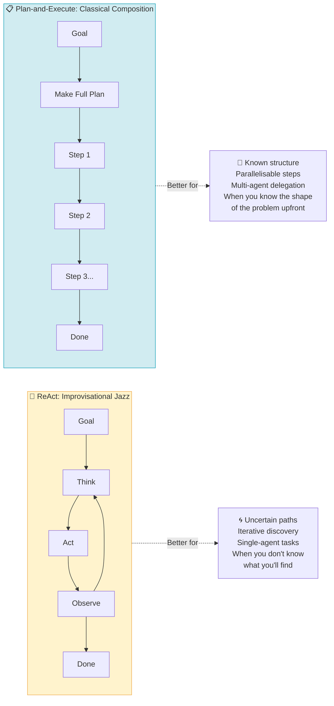
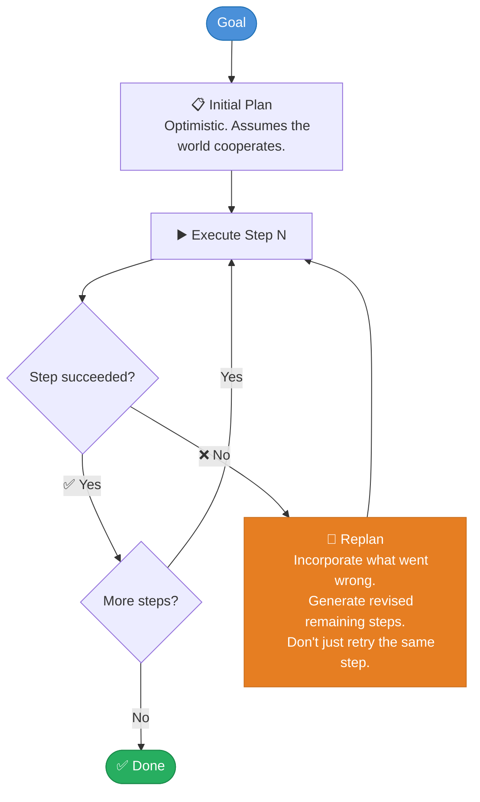

## 📋 Pattern 05 · Plan-and-Execute

> *"Plans are useless, but planning is indispensable."*
> - Dwight D. Eisenhower, who never had to debug a state graph

### What It Is

Plan-and-Execute is a two-phase approach:

1. **Plan** - The agent produces a complete, structured plan for the entire task *before* taking any actions.
2. **Execute** - The agent, or a dedicated executor, carries out each step of the plan.

This is distinct from ReAct, where the agent figures out each next step as it goes. Plan-and-Execute commits to a roadmap upfront. The roadmap can be inspected, modified, parallelised, delegated to multiple agents, and shared with a human for review before anything irreversible happens.

It can also be entirely wrong. We will address this shortly.

---

### 🗓️ What a Plan Looks Like

```
INPUT:  "Research the top 5 AI companies by funding in 2024,
         summarise their main products, and produce a comparison table."

PLAN (generated by the planner before any execution):
  ┌────────────────────────────────────────────────────────────────┐
  │  Step 1:  Search "top AI companies by funding 2024"            │
  │  Step 2:  Identify the top 5 companies from results            │
  │  Step 3:  For each company:                                    │
  │    Step 3a:  Search "[company] main products 2024"             │
  │    Step 3b:  Extract product names and descriptions            │
  │  Step 4:  Compile results into structured data                 │
  │  Step 5:  Format as a comparison table:                        │
  │           Company | Founded | Funding | Products | Focus       │
  │  Step 6:  Review table for completeness and accuracy           │
  └────────────────────────────────────────────────────────────────┘

KEY ADVANTAGE: Steps 3a–3b can run in parallel for all 5 companies.
               Total time becomes: the time for 1 company, not 5.
               This is why Plan-and-Execute exists.
```

---

### 🔄 Plan-and-Execute vs. ReAct



---

### 🚧 The Fundamental Problem with Plans

Here is what nobody puts in their conference talk:

**Plans become wrong. Almost immediately. In the real world.**

You plan to search for *"top AI companies by funding 2024."* The search returns a paywalled article and three LinkedIn posts from people who are definitely experts. The plan assumed the search would return useful data. The plan did not include a contingency for paywalls and LinkedIn confidence.



**Three solutions, in order of preference:**

1. **Replan on failure** - when a step fails, regenerate the remaining plan with the new information. The plan should reflect reality, not the original optimism.
2. **Hybrid: Plan-and-ReAct** - Plan-and-Execute for high-level structure; ReAct to handle each step's execution. The plan gives direction; the loop handles reality.
3. **Human checkpoint** - after planning, before executing, show the plan to a human. This is not a weakness. This is engineering wisdom dressed as humility.
