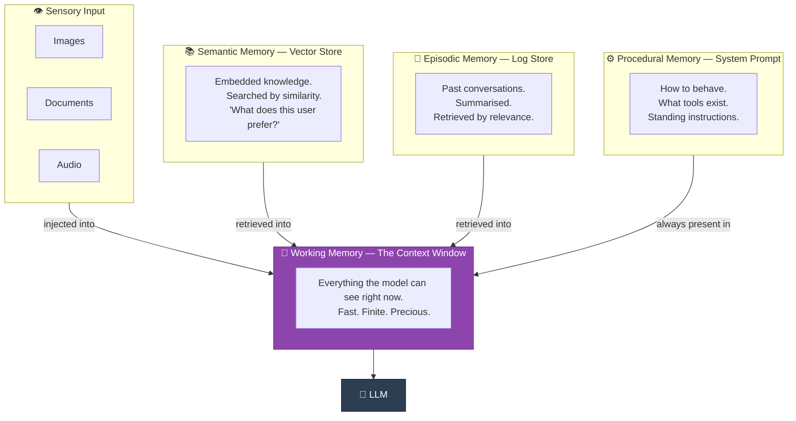
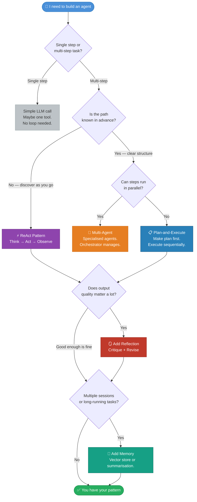

## 🧠 Pattern 07 · Memory Patterns

> *"The first time you tell an agent your name, it will be delighted.*
> *The second time, it will also be delighted.*
> *It will be delighted every single time, forever,*
> *because it has no idea who you are.*
> *This is either charming or infuriating depending on your relationship to impermanence."*

### What It Is

Language models have no persistent memory. Every call starts from scratch. Every agent run is, to the model, the first moment of its existence — a consciousness that springs into being, processes a context window, and ceases. Whether this is philosophically significant is left as an exercise for the reader.

What it means practically: anything you want the agent to *remember* across sessions must be **explicitly engineered**. Memory does not happen by default. Memory is infrastructure. Memory is your problem.

---

### 🧠 The Four Memory Types



---

### 🏗️ Three Implementation Patterns

#### Pattern 1: In-Context Memory *(Start Here)*

```python
# Just put relevant history in the context window.
# No database. No embeddings. No infrastructure. Just tokens.

system_prompt = """
You are an assistant for Alex Chen.

Relevant context from previous sessions:
- [Jan 15] Alex mentioned they hate Comic Sans with uncommon intensity.
- [Jan 16] Alex's company is Acme Corp. They are the CTO.
- [Jan 17] Alex is working on a Python project called "Zephyr."
- [Jan 20] Alex prefers responses under 200 words unless more is requested.
"""
```

**Pros:** Zero infrastructure. Works immediately.
**Cons:** Context window is finite. You will eventually hit the limit and need to decide what to forget. Deciding what to forget is an underrated engineering challenge.
**Verdict:** Start here. Move on when the context fills up.

---

#### Pattern 2: External Store with Retrieval *(The Scalable Option)*

```python
# chromadb, Pinecone, Weaviate, pgvector — pick your vector store.
# They all do roughly the same thing.

def remember(fact: str, user_id: str):
    """Store a fact. It will be retrievable later."""
    db.add(
        documents=[fact],
        ids=[generate_id()],
        metadatas=[{"user_id": user_id, "timestamp": now()}]
    )

def recall(query: str, user_id: str, n: int = 5) -> list[str]:
    """Find the facts most semantically relevant to this context."""
    results = db.query(
        query_texts=[query],
        where={"user_id": user_id},
        n_results=n
    )
    return results["documents"][0]

# Before calling the LLM:
relevant_memories = recall(
    query="What are this user's current projects and preferences?",
    user_id=user_id
)
# Inject only the relevant ones. Not all of them. Never all of them.
```

---

#### Pattern 3: Summarisation Memory *(Graceful Degradation)*

```python
def compress_history(history: list[dict], llm) -> str:
    """
    When context fills up, summarise the past.
    Keep the meaning. Discard the transcript.
    This is what humans do. We call it 'remembering.'
    """
    return llm.generate(f"""
        Summarise this conversation into:
        - Key facts established
        - Decisions that were made
        - Important context for future interactions
        - Preferences and constraints revealed

        Conversation:
        {format_history(history)}

        Be concise. Keep facts. Discard pleasantries.
        The summary should be useful to someone who never
        read the original conversation.
    """)

# When context exceeds ~80% of the window:
summary = compress_history(old_messages, llm)
messages = [{"role": "system", "content": f"Previous context: {summary}"}]
# Plus the most recent N messages, in full
```

---

### 📊 Memory Type Comparison

| Memory Type | Speed | Cost | Capacity | Best For |
|:-----------|:-----:|:----:|:--------:|:---------|
| In-context | ⚡ Instant | 💰 Token cost only | Limited by window | Short sessions, simple personalisation |
| Vector store | 🏃 Fast | 💰💰 Storage + retrieval | Effectively unlimited | User preferences, knowledge bases |
| SQL / KV store | ⚡ Instant | 💰 Minimal | Unlimited | Structured facts, exact lookups |
| Summarisation | 🐢 Slow | 💰💰 Extra LLM calls | Unlimited | Long conversation histories |
| Fine-tuning | N/A | 💰💰💰💰 Very expensive | Fixed at training time | Stable, universal knowledge only |

> 💡 **The insight most people learn too late:** The hard problem is not storing memories. The hard problem is deciding *which memories to retrieve* and *when to forget*. Over-retrieval floods context with irrelevant history. Under-retrieval produces an agent that feels inconsistent. The retrieval strategy matters as much as the storage strategy. Sometimes more.

---

<br>

## 🗺️ Pattern Selection Guide

*With great patterns come great architectural decisions. This guide will not make them for you, but it will tell you which questions to ask.*



---

## 📚 Pattern Quick Reference

```
┌──────────────────────────────────────────────────────────────────────┐
│                         PATTERN CHEAT SHEET                          │
├──────────────────┬──────────────────────────┬────────────────────────┤
│  PATTERN         │  USE WHEN                │  WATCH OUT FOR         │
├──────────────────┼──────────────────────────┼────────────────────────┤
│  🔄 ReAct         │  Path unknown upfront    │  Infinite loops       │
│                  │  General-purpose tasks   │  Context filling up    │
│                  │  Iterative discovery     │  Hallucinated results  │
├──────────────────┼──────────────────────────┼────────────────────────┤
│  🔗 Chain-of-     │  Maths and reasoning     │  More tokens, slower  │
│     Thought      │  Multi-constraint probs  │  Overkill for simple   │
│                  │  Accuracy over speed     │  lookups               │
├──────────────────┼──────────────────────────┼────────────────────────┤
│  🛠️  Tool Use     │  Needs external data     │  Over-permissioned    │
│                  │  World-affecting actions │  agents                │
│                  │  Anything beyond context │  Hallucinated calls    │
├──────────────────┼──────────────────────────┼────────────────────────┤
│  🪞 Reflection    │  Quality matters a lot   │  Latency and cost     │
│                  │  High-stakes outputs     │  Model may be lenient  │
│                  │  Complex writing or code │  with its own work     │
├──────────────────┼──────────────────────────┼────────────────────────┤
│  📋 Plan-and-     │  Known structure         │  Plans go stale fast  │
│     Execute      │  Parallelisable steps    │  Need replanning logic │
│                  │  Delegation needed       │  Reality differs from  │
│                  │                          │  the original plan     │
├──────────────────┼──────────────────────────┼────────────────────────┤
│  🤝 Multi-Agent   │  Genuinely large tasks   │ Exponential complexity│
│                  │  Specialisation needed   │  Silent failures       │
│                  │  Parallel execution      │  3–5× higher cost      │
├──────────────────┼──────────────────────────┼────────────────────────┤
│  🧠 Memory        │  Multi-session work      │ What to forget is as  │
│                  │  Personalisation         │  hard as what to store │
│                  │  Long-running agents     │  Retrieval strategy    │
│                  │                          │  matters enormously    │
└──────────────────┴──────────────────────────┴────────────────────────┘
```

---

## 🚀 What's Next

You now have the patterns. The vocabulary. The failure modes. The decision tree. The cheat sheet for the wall above your monitor.

What you don't have yet is working code that uses a real framework — the scaffolding that manages the loop, owns the state, routes tool calls, handles retries, produces traces you can actually debug, and requires configuring several things before anything runs.

That's Section 03.

> *"Section 03 covers the major agent frameworks: LangGraph, CrewAI, the OpenAI Agents SDK, and MCP. These frameworks are, in the words of a senior engineer who shall remain anonymous, 'like democracy — the worst possible solution except for all the other ones that were tried before them.'"*

---

<div align="center">

```
──────────────────────────────────────────────────────────────────
  Section 02 complete.   7 patterns.   No panicking.
──────────────────────────────────────────────────────────────────
```

*github.com/your-username/hitchhikers-guide-to-ai-agents*

</div>