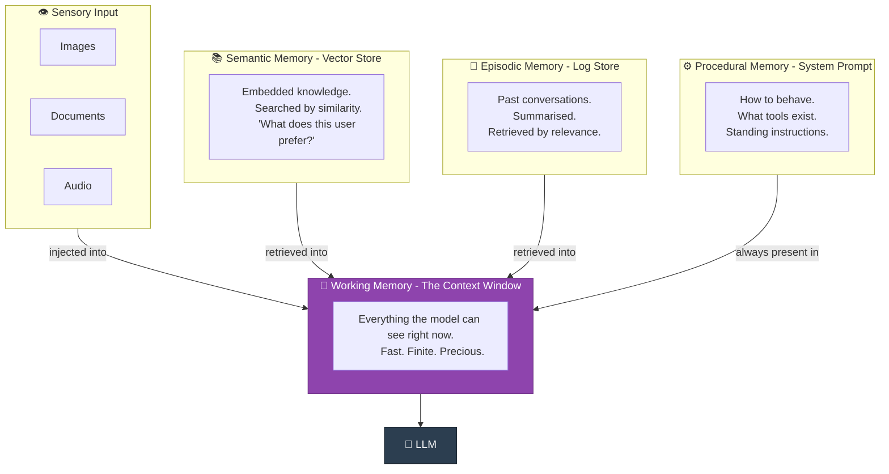

## 🧠 Pattern 07 · Memory Patterns

> *"The first time you tell an agent your name, it will be delighted.*
> *The second time, it will also be delighted.*
> *It will be delighted every single time, forever,*
> *because it has no idea who you are.*
> *This is either charming or infuriating depending on your relationship to impermanence."*

### What It Is

Language models have no persistent memory. Every call starts from scratch. Every agent run is, to the model, the first moment of its existence - a consciousness that springs into being, processes a context window, and ceases. Whether this is philosophically significant is left as an exercise for the reader.

What it means practically: anything you want the agent to *remember* across sessions must be **explicitly engineered**. Memory does not happen by default. Memory is infrastructure. Memory is your problem.

---

### 🧠 The Four Memory Types



---

### 🏗️ Three Implementation Patterns

#### Pattern 1: In-Context Memory *(Start Here)*

```python
# Just put relevant history in the context window.
# No database. No embeddings. No infrastructure. Just tokens.

system_prompt = """
You are an assistant for Alex Chen.

Relevant context from previous sessions:
- [Jan 15] Alex mentioned they hate Comic Sans with uncommon intensity.
- [Jan 16] Alex's company is Acme Corp. They are the CTO.
- [Jan 17] Alex is working on a Python project called "Zephyr."
- [Jan 20] Alex prefers responses under 200 words unless more is requested.
"""
```

**Pros:** Zero infrastructure. Works immediately.
**Cons:** Context window is finite. You will eventually hit the limit and need to decide what to forget. Deciding what to forget is an underrated engineering challenge.
**Verdict:** Start here. Move on when the context fills up.

---

#### Pattern 2: External Store with Retrieval *(The Scalable Option)*

```python
# chromadb, Pinecone, Weaviate, pgvector - pick your vector store.
# They all do roughly the same thing.

def remember(fact: str, user_id: str):
    """Store a fact. It will be retrievable later."""
    db.add(
        documents=[fact],
        ids=[generate_id()],
        metadatas=[{"user_id": user_id, "timestamp": now()}]
    )

def recall(query: str, user_id: str, n: int = 5) -> list[str]:
    """Find the facts most semantically relevant to this context."""
    results = db.query(
        query_texts=[query],
        where={"user_id": user_id},
        n_results=n
    )
    return results["documents"][0]

# Before calling the LLM:
relevant_memories = recall(
    query="What are this user's current projects and preferences?",
    user_id=user_id
)
# Inject only the relevant ones. Not all of them. Never all of them.
```

---

#### Pattern 3: Summarisation Memory *(Graceful Degradation)*

```python
def compress_history(history: list[dict], llm) -> str:
    """
    When context fills up, summarise the past.
    Keep the meaning. Discard the transcript.
    This is what humans do. We call it 'remembering.'
    """
    return llm.generate(f"""
        Summarise this conversation into:
        - Key facts established
        - Decisions that were made
        - Important context for future interactions
        - Preferences and constraints revealed

        Conversation:
        {format_history(history)}

        Be concise. Keep facts. Discard pleasantries.
        The summary should be useful to someone who never
        read the original conversation.
    """)

# When context exceeds ~80% of the window:
summary = compress_history(old_messages, llm)
messages = [{"role": "system", "content": f"Previous context: {summary}"}]
# Plus the most recent N messages, in full
```

---

### 📊 Memory Type Comparison

| Memory Type | Speed | Cost | Capacity | Best For |
|:-----------|:-----:|:----:|:--------:|:---------|
| In-context | ⚡ Instant | 💰 Token cost only | Limited by window | Short sessions, simple personalisation |
| Vector store | 🏃 Fast | 💰💰 Storage + retrieval | Effectively unlimited | User preferences, knowledge bases |
| SQL / KV store | ⚡ Instant | 💰 Minimal | Unlimited | Structured facts, exact lookups |
| Summarisation | 🐢 Slow | 💰💰 Extra LLM calls | Unlimited | Long conversation histories |
| Fine-tuning | N/A | 💰💰💰💰 Very expensive | Fixed at training time | Stable, universal knowledge only |

> 💡 **The insight most people learn too late:** The hard problem is not storing memories. The hard problem is deciding *which memories to retrieve* and *when to forget*. Over-retrieval floods context with irrelevant history. Under-retrieval produces an agent that feels inconsistent. The retrieval strategy matters as much as the storage strategy. Sometimes more.