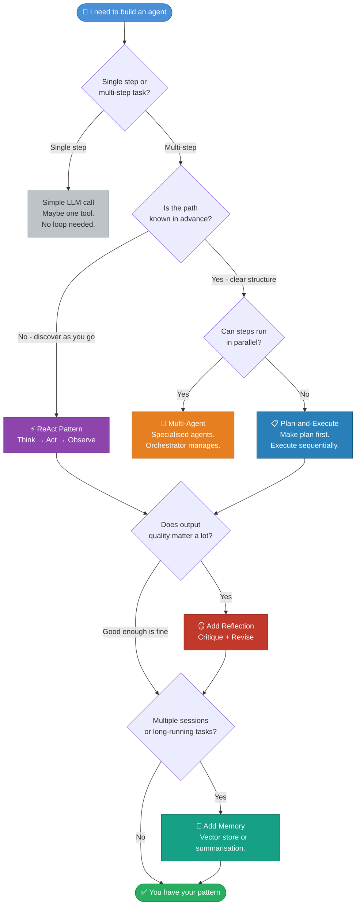

## 🗺️ Pattern Selection Guide

*With great patterns come great architectural decisions. This guide will not make them for you, but it will tell you which questions to ask.*



---

## 📚 Pattern Quick Reference

```
┌──────────────────────────────────────────────────────────────────────┐
│                         PATTERN CHEAT SHEET                          │
├──────────────────┬──────────────────────────┬────────────────────────┤
│  PATTERN         │  USE WHEN                │  WATCH OUT FOR         │
├──────────────────┼──────────────────────────┼────────────────────────┤
│  🔄 ReAct         │  Path unknown upfront    │  Infinite loops       │
│                  │  General-purpose tasks   │  Context filling up    │
│                  │  Iterative discovery     │  Hallucinated results  │
├──────────────────┼──────────────────────────┼────────────────────────┤
│  🔗 Chain-of-     │  Maths and reasoning     │  More tokens, slower  │
│     Thought      │  Multi-constraint probs  │  Overkill for simple   │
│                  │  Accuracy over speed     │  lookups               │
├──────────────────┼──────────────────────────┼────────────────────────┤
│  🛠️  Tool Use     │  Needs external data     │  Over-permissioned    │
│                  │  World-affecting actions │  agents                │
│                  │  Anything beyond context │  Hallucinated calls    │
├──────────────────┼──────────────────────────┼────────────────────────┤
│  🪞 Reflection    │  Quality matters a lot   │  Latency and cost     │
│                  │  High-stakes outputs     │  Model may be lenient  │
│                  │  Complex writing or code │  with its own work     │
├──────────────────┼──────────────────────────┼────────────────────────┤
│  📋 Plan-and-     │  Known structure         │  Plans go stale fast  │
│     Execute      │  Parallelisable steps    │  Need replanning logic │
│                  │  Delegation needed       │  Reality differs from  │
│                  │                          │  the original plan     │
├──────────────────┼──────────────────────────┼────────────────────────┤
│  🤝 Multi-Agent   │  Genuinely large tasks   │ Exponential complexity│
│                  │  Specialisation needed   │  Silent failures       │
│                  │  Parallel execution      │  3–5× higher cost      │
├──────────────────┼──────────────────────────┼────────────────────────┤
│  🧠 Memory        │  Multi-session work      │ What to forget is as  │
│                  │  Personalisation         │  hard as what to store │
│                  │  Long-running agents     │  Retrieval strategy    │
│                  │                          │  matters enormously    │
└──────────────────┴──────────────────────────┴────────────────────────┘
```

---

## 🚀 What's Next

You now have the patterns. The vocabulary. The failure modes. The decision tree. The cheat sheet for the wall above your monitor.

What you don't have yet is working code that uses a real framework - the scaffolding that manages the loop, owns the state, routes tool calls, handles retries, produces traces you can actually debug, and requires configuring several things before anything runs.

That's Section 03.

> *"Section 03 covers the major agent frameworks: LangGraph, CrewAI, the OpenAI Agents SDK, and MCP. These frameworks are, in the words of a senior engineer who shall remain anonymous, 'like democracy - the worst possible solution except for all the other ones that were tried before them.'"*

---

<div align="center">

```
──────────────────────────────────────────────────────────────────
  Section 02 complete.   7 patterns.   No panicking.
──────────────────────────────────────────────────────────────────
```

*github.com/ayu1712/Guide-AI-Agents*

</div>